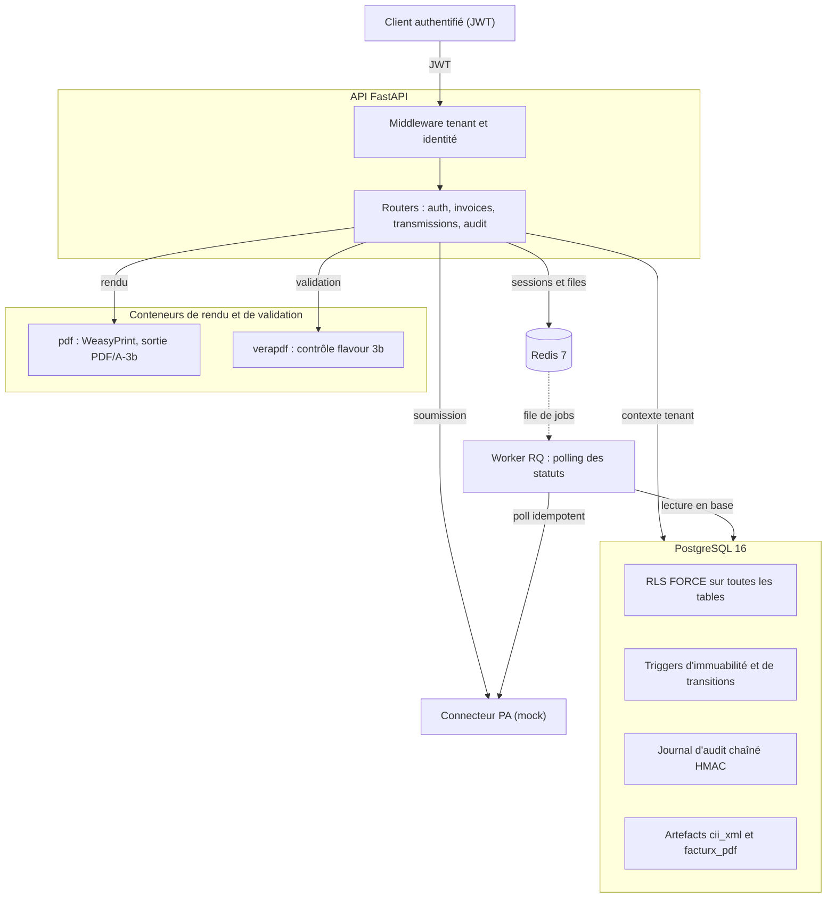
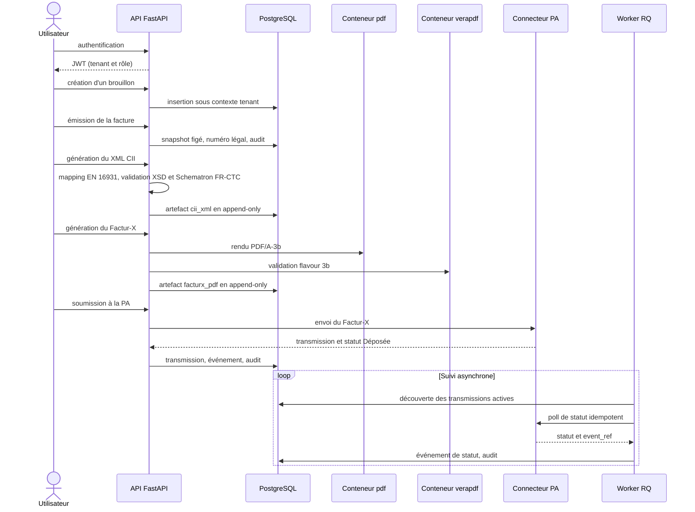

# Architecture d'epitaxy

Ce document présente l'architecture sous trois angles complémentaires : les composants du système, le modèle de sécurité de la base, et le parcours d'une facture de bout en bout.

## Composants du système

epitaxy est une API FastAPI adossée à une base PostgreSQL qui porte elle-même l'isolation entre clients. Deux traitements lourds, le rendu du PDF et la validation PDF/A, sont délégués à des conteneurs dédiés invoqués à la demande. Redis assure le rate limiting, la révocation des jetons de rafraîchissement et la file de jobs du worker. Le worker RQ suit le cycle de vie des transmissions de façon asynchrone. Le connecteur vers la Plateforme Agréée est aujourd'hui un mock derrière une interface stable.

## Modèle de sécurité de la base

L'isolation entre clients n'est pas filtrée en applicatif, elle est portée par PostgreSQL. Toutes les tables sont en RLS avec FORCE ROW LEVEL SECURITY, et chaque requête s'exécute sous un contexte de tenant posé explicitement (SET LOCAL app.tenant_id), refusé s'il est absent. Quatre rôles se répartissent des responsabilités disjointes.

| Rôle | Nature | Rôle dans le système | Points clés |
|---|---|---|---|
| `migrator` | propriétaire du schéma | migrations Alembic | crée les tables, mais reste soumis à FORCE RLS |
| `app_user` | applicatif | toutes les requêtes de l'API | non propriétaire, sans BYPASSRLS, soumis à la RLS |
| `pa_scanner` | découverte | fonction SECURITY DEFINER de suivi des transmissions | NOLOGIN, lecture seule ciblée, ne retourne que des identifiants |
| superutilisateur | initialisation | création des rôles, fixtures de test | hors du chemin applicatif |

Ce cloisonnement, avec un rôle applicatif non privilégié et des accès élargis accordés de façon chirurgicale et nominative, est ce qui rend l'isolation réelle plutôt que déclarative. Les journaux d'audit et les artefacts de facture sont en outre append-only : les droits de modification et de suppression sont révoqués pour le rôle applicatif, et le journal d'audit est chaîné par HMAC pour rendre toute altération détectable.

## Parcours d'une facture

Le parcours suit une ligne stricte. L'émission fige les données de la facture et lui attribue un numéro légal continu, après quoi elle est immuable. La génération du Factur-X lit ces données figées, produit un XML validé aux règles EN 16931 et françaises, puis un PDF/A-3 contrôlé par veraPDF. La transmission passe par le connecteur PA, et le worker suit ensuite les statuts de façon idempotente. Chaque opération sensible est inscrite dans le journal d'audit chaîné.
